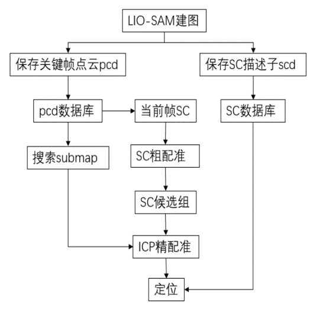
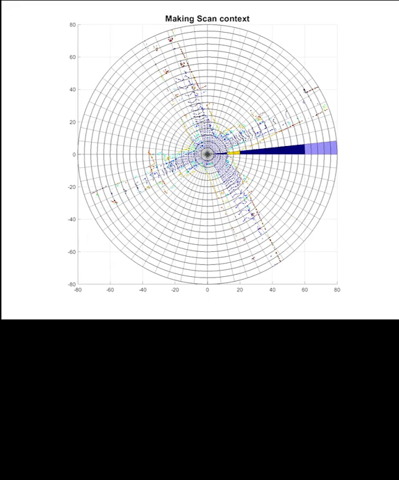

## What is SC-LIO-SAM?
- SC-LIO-SAM is **a real-time lidar-inertial SLAM package.**
  - LiDAR-inertial SLAM: Scan Context + LIO-SAM
- This repository is an example use-case of [Scan Context](https://github.com/irapkaist/scancontext), which is a fast and robust LiDAR place recognition method.
- For more details for each algorithm please refer to <br>
  Scan Context https://github.com/irapkaist/scancontext <br>
  LIO-SAM https://github.com/TixiaoShan/LIO-SAM <br>
- You can also use the LiDAR-only versions of this project: [SC-LeGO-LOAM](https://github.com/irapkaist/SC-LeGO-LOAM) and [SC-A-LOAM](https://github.com/gisbi-kim/SC-A-LOAM).

## Scan Context: A fast and robust place recognition
- Light-weight: a single header and cpp file named "Scancontext.h" and "Scancontext.cpp"
    - Our module has KDtree and we used <a href="https://github.com/jlblancoc/nanoflann"> nanoflann</a>. nanoflann is an also single-header-program and that file is in our directory.
- Easy to use: A user just remembers and uses only two API functions; ```makeAndSaveScancontextAndKeys``` and ```detectLoopClosureID```.
- Fast: A single loop detection requires under 30 ms (for 20 x 60 size, 3 candidates)

## How to use?
- We provide a tutorial that runs SC-LIO-SAM on MulRan dataset, you can reproduce the above results by following these steps. 

1. You can download the dataset at the [MulRan dataset website](https://sites.google.com/view/mulran-pr/home)
2. Place the directory `SC-LIO-SAM` under user catkin work space <br>
 For example, 
    ```
    cd ~/catkin_ws/src
    git clone https://github.com/gisbi-kim/SC-LIO-SAM.git
    cd ..
    catkin_make
    source devel/setup.bash
    roslaunch lio_sam run.launch # or roslaunch lio_sam run_mulran.launch
    ```
3. By following [this guideline](https://github.com/irapkaist/file_player_mulran), you can easily publish the MulRan dataset's LiDAR and IMU topics via ROS.

## Application
### Framework
<centre>

</centre>

### SC generation
<centre>

</centre>

### Test
<centre>

</centre>


